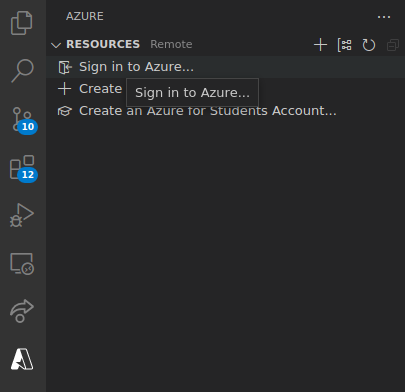
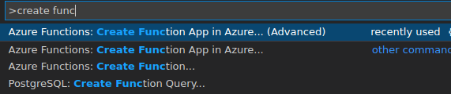
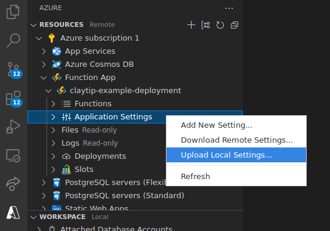
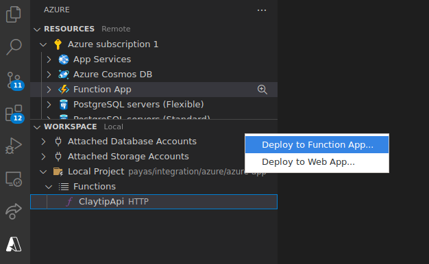
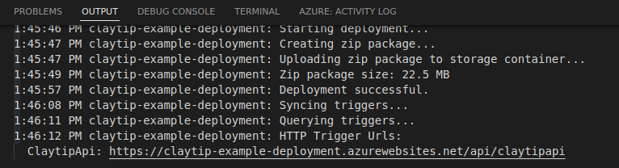

This is an example app to show how to deploy Claytip as an Azure function
through Visual Studio Code. This step depends on Docker being installed and set up.

1. Build `azure-app/` in this directory using `./build.sh -c example.clay`. This
   directory will contain the final Azure function deployment.

2. Install the
   [Azure Tools Extension Pack](https://marketplace.visualstudio.com/items?itemName=ms-vscode.vscode-node-azure-pack)
   and sign in with your Azure account:

   

   Make sure that you have an Azure subscription active beforehand. You can sign
   up for the
   [Azure Free Trial](https://azure.microsoft.com/en-us/offers/ms-azr-0044p/).

3. Create a function app with advanced setup through the command palette (Ctrl+Shift+P):

   

   Use the following settings:
   - Runtime stack: Custom Handler
   - OS: Linux
   - Hosting plan: Consumption

4. Set `CLAY_DATABASE_URL` and `CLAY_DATABASE_USER` appropriately in
   `local.settings.json`. The PostgreSQL database must be provisioned and set up
   separately. Upload the settings to your function app through the sidebar:

   

5. Deploy ClaytipApi to your function app:

   

   Select your created function app. The final API URL will be printed in the
   output window of the deployment process.

   

6. When finished, make sure to delete the resource group associated with the
   function app to avoid incurring charges.
